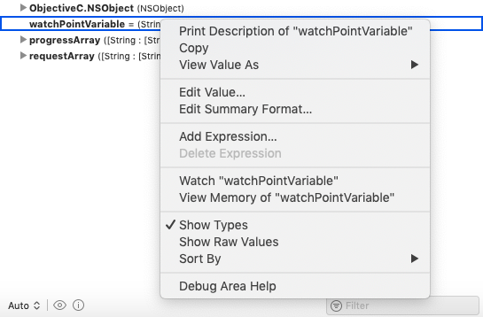

| Title  | Tip Number | Tip Username | Tip User Profile | Tip descriptions |
| ------------- | ------------- | ------------- | ------------- | ------------- |
| Watchpoints in Xcode  | 07  | Poorvitha  | https://github.com/Poorvitha  | Watching value changes of a variable in xcode  |

We’re probably familiar with Xcode’s breakpoints. A Watchpoint is a kind of a breakpoint that you set on an address or variable, to stop anytime a value is accessed, rather than being set at a point of execution.

We can use a watchpoint to isolate when a variable is changed during execution, which can be especially useful for debugging state that is shared across multiple components in code. Once you know where and how a variable is changed, you create breakpoints at points in execution that you want to investigate, and then remove the watchpoint.

To try it out, 

1. To set the watchpoint, you need to be paused in the debugger within a stack frame that has the variable you want to watch in scope. Place a breakpoint in your program next to a statement that creates instance of variable/address you want to watch, then run your code. 

2. When the breakpoint hits, look for your variable inside the variables view – that’s in Xcode’s debug area at the bottom, to the left of the console.

3. Right-click on the variable/instance and choose “Watch”. Once that’s done, anywhere the variable is read from or written to, Xcode will pause and you can use the debug navigator to step through the call stack to figure out what happened. 

