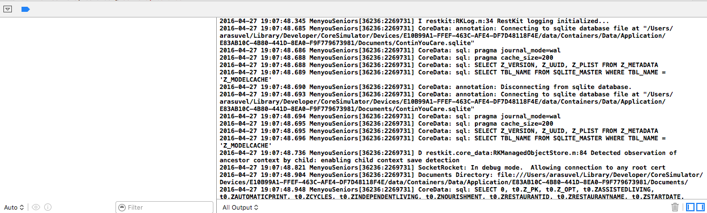

Steps to log the core data queries in console

1. Open the manage scheme window. 
2. Click on Run and move to aruments.
3. Add the follwing command in run arguments : 

```bash
-com.apple.CoreData.SQLDebug 1
```


4. Build and Run your project you will see the SQL queries in console.

