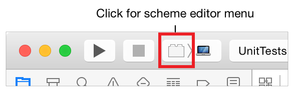
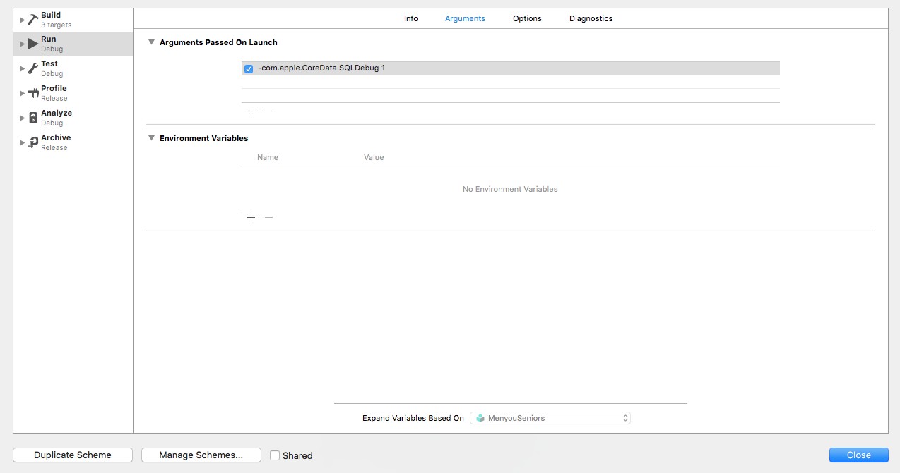
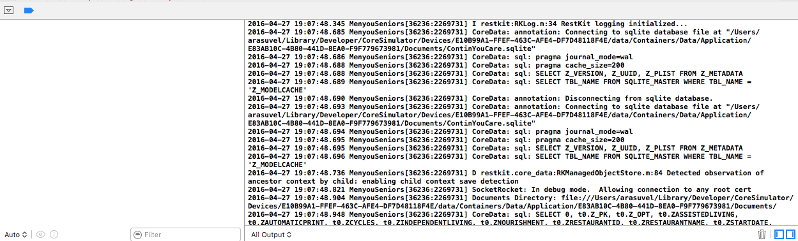

Steps to log the core data queries in console

1. Select Edit Scheme from the scheme editor menu.

2. Select the Test action and move to arguments section.
3. Add the follwing command in run arguments : 

```bash
-com.apple.CoreData.SQLDebug 1
```



4. Build and Run your project you will see the SQL queries in console.

