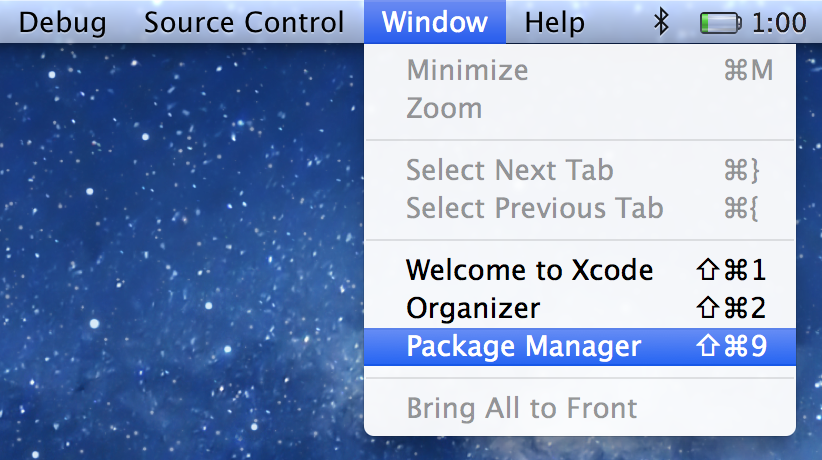

#Alcatraz : A package manager for Xcode.

##What is Alcatraz ?
Alcatraz is an open-source package manager for Xcode. It lets you discover and install plugins, templates and color schemes without the need for manually cloning or copying files. It installs itself as a part of Xcode and it feels like home.

**Note*:** Alcatraz is available for Xcode 7+ only.

##How to use it ?
Select Package Manager from the Window menu, then check or uncheck packages to install or remove them. You'll need to restart Xcode after installing certain packages, as indicated after installation.



##How to Install it ?
Paste this into your terminal:

	curl -fsSL https://raw.githubusercontent.com/supermarin/Alcatraz/deploy/Scripts/install.sh | sh

##How to Uninstall it ?
###Delete the plugin:

	rm -rf ~/Library/Application\ Support/Developer/Shared/Xcode/Plug-ins/Alcatraz.xcplugin
	
###Remove all cached data:

	rm -rf ~/Library/Application\ Support/Alcatraz
