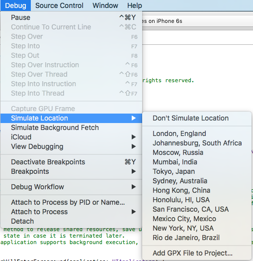
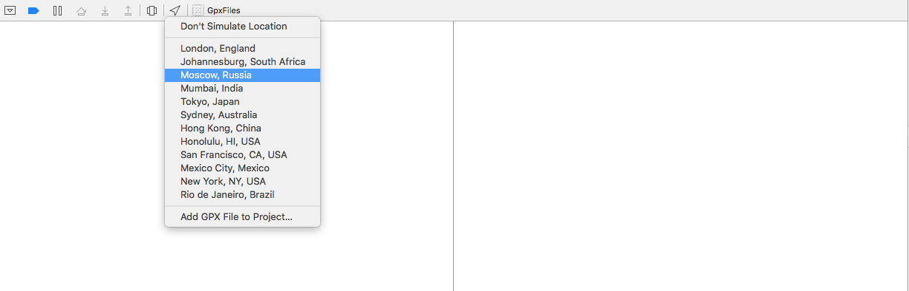

### Creating gpx files

Xcode uses a standardized file type to simulate locations. The GPX spec defines many different ways to define a path or a set of geolocation coordinates. Xcode only uses the <wpt> tag so if you find a tool that generates <rte> or <trk> based gpx files, Xcode won't be able simulate your location properly.

The format for GPX files that Xcode looks for is fairly straightforward:

    <gpx>
        <wpt lat="38.897678" lon="-77.036517"></wpt>
    </gpx>

### Adding gpx files to xcode

In Xcode, open a project you have for an iPhone or iPad app, and build it to your device. Once the app is running on your device, go to Product > Debug > Simulate Location, and select the last option in the list that says “Add GPX File to Project…”, then select the file we just created. Xcode will pop up some options for adding the file; the defaults should be fine, so just click on Finish.

### Debugging using gpx files

Now, if you go back to Product > Debug > Simulate Location, you should see file added near the top of the list; click on it (you can also get to this list from the debug bar at the bottom of Xcode, just click on the location services arrow icon). 

To check, press the home button on your device to close your app and go to Maps app. If it didn’t seem to work, check Xcode and make sure the location arrow in the debug bar is blue. If it’s still gray, Xcode doesn’t like something about your GPX file.

