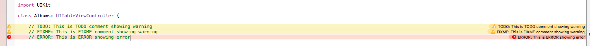

In your everyday work environment you will always come across a section of code that you absolutely need to revisit later but have to temporarily patch up to move on. Unfortunately, even a simple //TODO:, //FIXME:, or //ERROR: in a comment is just not enough. You'd be surprised how many people forget their //TODO:'s, //FIXME:'s, and //ERROR:'s in a project's lifetime. Using a run script in this situation is a great way to ensure you don't miss a thing in your project development cycle. Follow the below steps :

<br>
1. Navigate to your project's build phases in Xcode, click on the + sign towards the top left of the window, and then click on "New Run Script Build Phase" in the drop down menu.

<br>
2. You should then see a new section added where you can inject your bash script. Copy and paste the code below :

```bash
TAGS="TODO:|FIXME:"
ERRORTAG="ERROR:"
find "${SRCROOT}" \( -name "*.h" -or -name "*.m" -or -name "*.swift" \) -print0 | xargs -0 egrep --with-filename --line-number --only-matching "($TAGS).*\$|($ERRORTAG).*\$" | perl -p -e "s/($TAGS)/ warning: \$1/" | perl -p -e "s/($ERRORTAG)/ error: \$1/"
```
<br>
3. Build your project to see the changes like the one shown below.



When my IDE looks like that, I feel pretty compelled to get things done. And don't worry, error's generated using this run script WILL NOT fail your build.
