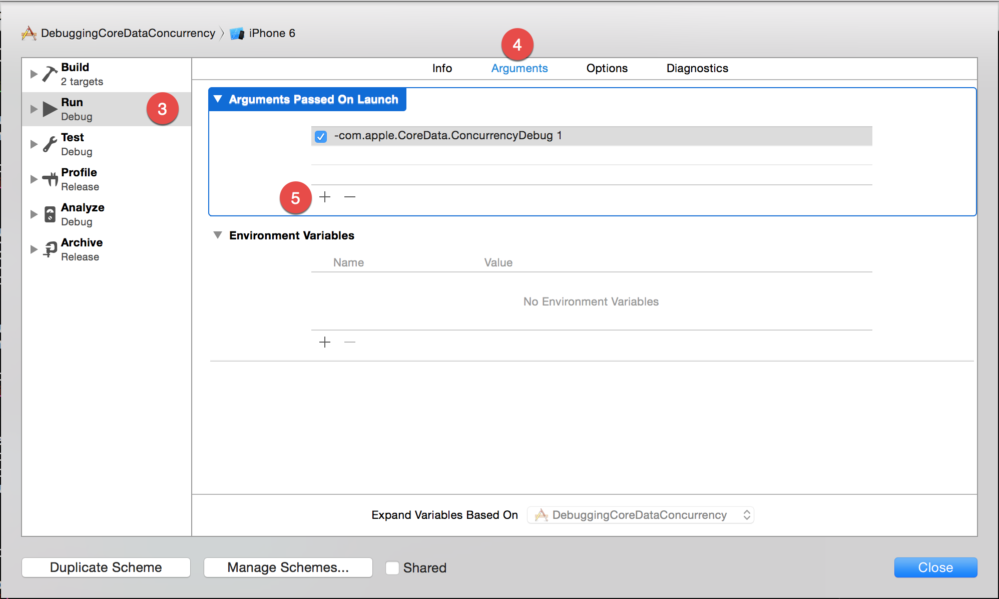
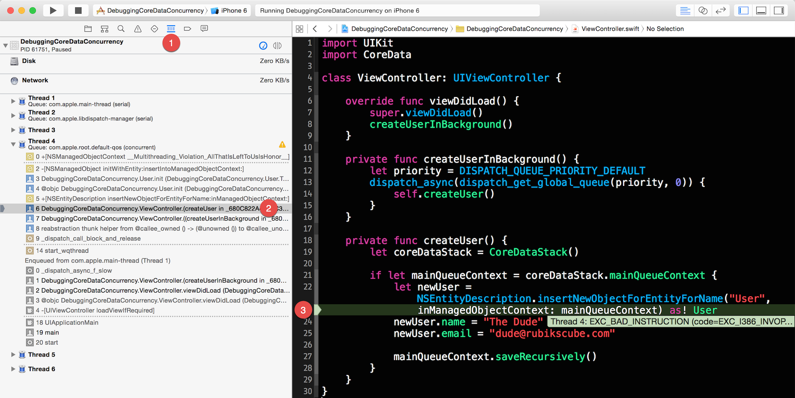

#Tracking Violations

Listed below are step-by-step instructions for tracking Core Data concurrency violations.

**Step 1:** Enable Core Data multi-threading assertions by passing following arguments during app launch.

    -com.apple.CoreData.ConcurrencyDebug 1

Xcode lets us specify which arguments to pass during the app launch from the scheme editor as shown in figures below.

**Step 2:** Verify that Xcode prints out following text in console to indicate that the multi-threading assertions is enabled. You can use the keyboard shortcut ⌘⇧Y to bring up the console.

    CoreData: annotation: Core Data multi-threading assertions enabled.

Note: Once the Core Data debugging is enabled, Xcode will throw an exception whenenver the app attempts to access an instance of managed object from a wrong context.

**Step 3:** Locate code that violates the concurrency rule. Go through the use case that exercises the code you suspect is violating the concurrency rule. If your suspicion is true, Xcode will throw an exception.

When an exception is thrown, Xcode might take you directly to the offending code. But if that is not the case, use the keyboard shortcut ⌘6 to reveal the debug navigator. Now dig into the call stack for each thread until you have tracked down the offending code. Figure below shows an example call stack leading us to the code that is violating the concurrency rule.

